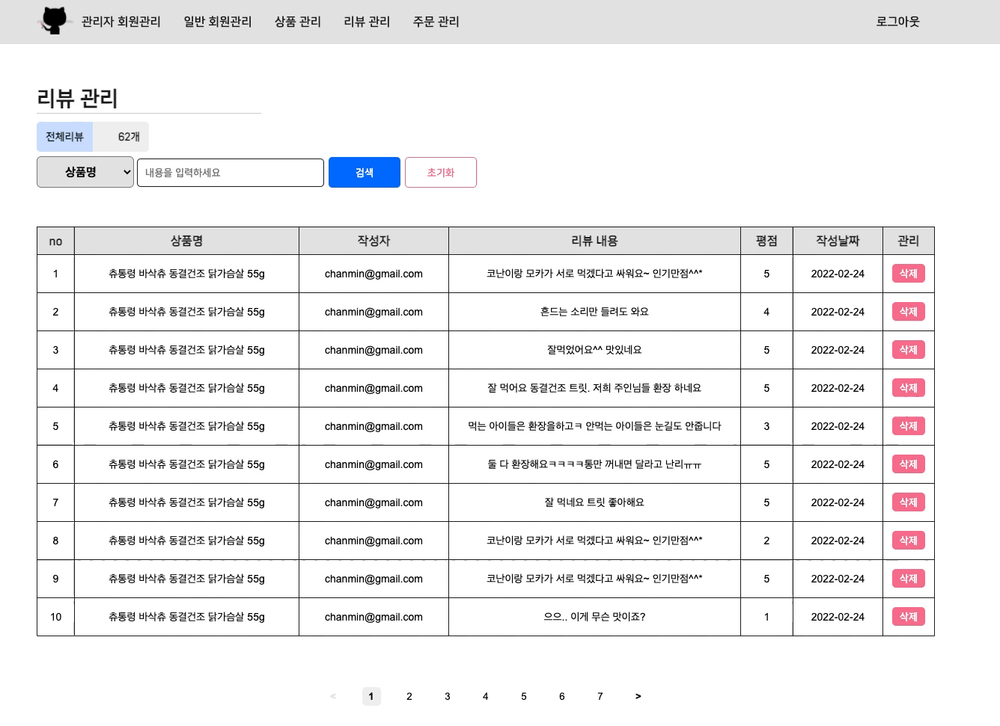

# TheGreatCatsby-FrontEnd

   

<br>

## 👋 소개

고양이 용품 쇼핑몰 웹사이트 '위대한 캣츠비' 프론트엔드 프로젝트 입니다.<br> 해당 프로젝트의 백엔드는 '[위대한 캣츠비 백엔드 저장소](https://github.com/Team-Stuckyi/TheGreatCatsby-BackEnd)'에서 확인하실 수 있고, 프로젝트를 하면서 진행된 커뮤니케이션 방식에 관해서는 '[Team-Stuckyi](https://github.com/Team-Stuckyi/Team-Stuckyi#1-discord)'에서 확인하실 수 있습니다. <br>

<table>
    <tr>
        <td><a href="https://github.com/Team-Stuckyi/TheGreatCatsby-FrontEnd">Front-End</a></td>
        <td>
            
            
            
            
        </td>
    </tr>
    <tr>
        <td><a href="https://github.com/Team-Stuckyi/TheGreatCatsby-BackEnd">Back-End</a></td>
        <td>
            
            
        </td>
    </tr>
        <tr>
        <td><a href="https://github.com/Team-Stuckyi/TheGreatCatsby-Database">Database</a></td>
        <td>
            
        </td>
    </tr>
</table>

<br />

## 👥 멤버

|  |  |  |  |  |
| --- | --- | --- | --- | --- |
| <div align="center">[이병민](https://github.com/ByeongminLee)</div> | <div align="center">[김우영](https://github.com/0x000613)</div> | <div align="center">[노희재](https://github.com/heejj1206)</div> | <div align="center">[이슬기](https://github.com/abcabcp)</div> | <div align="center">[전찬민](https://github.com/cksals3753)</div> |

<br />

## 🚀 설치 및 실행

1.  설치

    -   프로젝트 클론

        ```sh
        git clone https://github.com/Team-Stuckyi/TheGreatCatsby-FrontEnd.git
        ```

    -   모듈 설치

        ```sh
        yarn install
        ```

2.  환경 변수 설정 <code>.env</code> 파일에 다음과 같이 정의

    > <code>sample.env</code> 파일 참조

    ```sh
    REACT_APP_SERVER_URL = "[서버주소]"
    ```

3.  실행
    ```sh
    yarn start
    ```

<br />

## 🔍사용자 페이지

### 🏷️ 메인페이지

-   구현 화면

    | <div align="center">기본 화면</div> |
    | --- |
    | 로그인 페이지, 각 상품 상세 정보 페이지로 접근이 가능함. 페이지네이션(화면당 상품 20개)이 적용되어 있으며, 페이지 넘김 시 스크롤이 최상단으로 고정됨. <br/><br/> |

    | <div align="center">카테고리별 필터링<br />(전체/사료/모래/장난감/캣타워)</div> | <div align="center">조건별 정렬 <br />(최근 등록순/가격낮은순/가격높은순/리뷰 많은순)</div> |
    | --- | --- |
    |  |  |

<br />

-   구성 요소

    | <div align="center">구분</div> | <div align="center">파일명 (\*.js)</div> | <div align="center">설 명</div> |
    | ------------------------------ | ---------------------------------------- | ------------------------------- |
    | 서버 연동                      | MainProductSlice                         | GET : /products/main            |
    | 공통 컴포넌트                  | Loading                                  | 로딩 시 출력                    |
    | 공통 컴포넌트                  | Container                                | 1200px 고정                     |
    | 공통 컴포넌트                  | Header                                   | 사용자 페이지 Header            |
    | 공통 컴포넌트                  | Footer                                   | 사용자 페이지 Footer            |
    | 공통 컴포넌트                  | Pagination                               | 한 페이지당 상품 20개 출력      |
    | 하위 컴포넌트                  | Tabs                                     | 카테고리 별 필터링 후 출력      |
    | 하위 컴포넌트                  | ListBar                                  | 조건별 필터링 후 출력           |
    | 하위 컴포넌트                  | ProdCard                                 | 각 상품 카드 디테일             |

---

<br />

### 🏷️ 상품 정보 페이지

-   구현 화면

    | <div align="center">기본 화면</div>                         | <div align="center">상품 수량 선택 기능</div>            |
    | ----------------------------------------------------------- | -------------------------------------------------------- |
    |  |  |

    | <div align="center">작성된 리뷰가 존재할 경우</div>         | <div align="center">작성된 리뷰가 존재하지 않을 경우</div>      |
    | ----------------------------------------------------------- | --------------------------------------------------------------- |
    |  |  |

<br />

-   구성 요소

    | <div align="center">구분</div> | <div align="center">파일명 (\*.js)</div> | <div align="center">설 명</div>    |
    | ------------------------------ | ---------------------------------------- | ---------------------------------- |
    | 서버 연동                      | ReviewListSlice                          | GET : /review/:prod_id             |
    | 서버 연동                      | ReviewProdInfoSlice                      | GET : /products/:prod_id           |
    | 공통 컴포넌트                  | Loading                                  | 로딩 시 출력                       |
    | 공통 컴포넌트                  | Container                                | 1200px 고정                        |
    | 공통 컴포넌트                  | Header                                   | 사용자 페이지 Header               |
    | 공통 컴포넌트                  | Footer                                   | 사용자 페이지 Footer               |
    | 공통 컴포넌트                  | Button                                   | 버튼 UI                            |
    | 하위 컴포넌트                  | ProdImg                                  | 상품이미지를 가져오는 컴포넌트     |
    | 하위 컴포넌트                  | ProdInfo                                 | 상품정보를 가져오는 컴포넌트       |
    | 하위 컴포넌트                  | ProdReview                               | 상품리뷰를 가져오는 컴포넌트       |
    | 하위 컴포넌트                  | ProdBuy                                  | 상품 구매(수량 선택등) UI 컴포넌트 |

    ***

<br />

### 🏷️ 리뷰 페이지

-   구현 화면

    | <div align="center">기본 화면</div>                 | <div align="center">리뷰 작성</div>                     |
    | --------------------------------------------------- | ------------------------------------------------------- |
    |  |  |

<br />

-   구성 요소

    | <div align="center">구분</div> | <div align="center">파일명 (\*.js)</div> | <div align="center">설 명</div> |
    | ------------------------------ | ---------------------------------------- | ------------------------------- |
    | 서버 연동                      | ReviewListSlice                          | GET : /review/:prod_id          |
    | 서버 연동                      | ReviewProdInfoSlice                      | GET : /products/:prod_id        |
    | 공통 컴포넌트                  | Loading                                  | 로딩 시 출력                    |
    | 공통 컴포넌트                  | Container                                | 1200px 고정                     |
    | 공통 컴포넌트                  | Header                                   | 사용자 페이지 Header            |
    | 공통 컴포넌트                  | Footer                                   | 사용자 페이지 Footer            |
    | 공통 컴포넌트                  | Button                                   | 버튼 UI                         |
    | 하위 컴포넌트                  | ProdImg                                  | 상품이미지를 가져오는 컴포넌트  |
    | 하위 컴포넌트                  | ProdInfo                                 | 상품정보를 가져오는 컴포넌트    |
    | 하위 컴포넌트                  | ProdReview                               | 상품리뷰를 가져오는 컴포넌트    |
    | 하위 컴포넌트                  | ReviewWrite                              | 상품리뷰를 작성하는 컴포넌트    |

<br />

<br />

### 🏷️ 결제 페이지

-   구현 화면

    | <div align="center">최근배송지 화면</div>                   | <div align="center">신규배송지 화면</div>                      |
    | ----------------------------------------------------------- | -------------------------------------------------------------- |
    |  |  |

<br />

-   결제 화면

    | <div align="center">토스결제</div>                        | <div align="center">카카오결제</div>                       |
    | --------------------------------------------------------- | ---------------------------------------------------------- |
    |  |  |

<br />

<br />

-   구성 요소

    | <div align="center">구분</div> | <div align="center">파일명 (\*.js)</div> | <div align="center">설 명</div> |
    | ------------------------------ | ---------------------------------------- | ------------------------------- |
    | 서버 연동                      | RecentMemberSlice                        | GET : /members/address/:user_id |
    | 서버 연동                      | ReviewProdInfoSlice                      | GET : /products/:prod_id        |
    | 서버 연동                      | NewMemberSlice                           | PUT : /members/newaddr/:user_id |
    | 서버 연동                      | ShowOrderSlice                           | POST : /orders/post             |
    | 공통 컴포넌트                  | Loading                                  | 로딩 시 출력                    |
    | 공통 컴포넌트                  | Container                                | 1200px 고정                     |
    | 공통 컴포넌트                  | Header                                   | 사용자 페이지 Header            |
    | 공통 컴포넌트                  | Footer                                   | 사용자 페이지 Footer            |
    | 공통 컴포넌트                  | Button                                   | 버튼 UI                         |
    | 공통 컴포넌트                  | ProdBill                                 | 결제 금액 영수증 컴포넌트       |
    | 하위 컴포넌트                  | ProdOrder                                | 상품정보를 가져오는 컴포넌트    |
    | 하위 컴포넌트                  | RecentAdress                             | 최근배송지를 가져오는 컴포넌트  |
    | 하위 컴포넌트                  | NewAdress                                | 신규배송지를 가져오는 컴포넌트  |
    | 하위 컴포넌트                  | PayMent                                  | 결제방법을 가져오는 컴포넌트    |

<br />

### 🏷️ 결제완료 페이지

-   구현 화면

    | <div align="center">기본 화면</div>                           |
    | ------------------------------------------------------------- |
    |  |

<br />

-   구성 요소

    | <div align="center">구분</div> | <div align="center">파일명 (\*.js)</div> | <div align="center">설 명</div> |
    | ------------------------------ | ---------------------------------------- | ------------------------------- |
    | 서버 연동                      | RecentMemberSlice                        | GET : /members/address/:user_id |
    | 서버 연동                      | ReviewProdInfoSlice                      | GET : /products/:prod_id        |
    | 공통 컴포넌트                  | Loading                                  | 로딩 시 출력                    |
    | 공통 컴포넌트                  | Container                                | 1200px 고정                     |
    | 공통 컴포넌트                  | Header                                   | 사용자 페이지 Header            |
    | 공통 컴포넌트                  | Footer                                   | 사용자 페이지 Footer            |
    | 공통 컴포넌트                  | Button                                   | 버튼 UI                         |
    | 공통 컴포넌트                  | ProdBill                                 | 결제 금액 영수증 컴포넌트       |
    | 하위 컴포넌트                  | PayAdress                                | 주문사항을 가져오는 컴포넌트    |

<br />

## 🔍관리자 페이지

### 🏷️ 관리자 로그인 페이지

-   구현 화면

    | <div align="center">기본 화면</div>                               |
    | ----------------------------------------------------------------- |
    |  |

<br />

-   구성 요소

    | <div align="center">구분</div> | <div align="center">파일명 (\*.js)</div> | <div align="center">설 명</div> |
    | ------------------------------ | ---------------------------------------- | ------------------------------- |
    | 서버 연동                      | adminLoginSlice, adminAppSlice           | POST : /admins/login            |
    | 공통 컴포넌트                  | Loading                                  | 로딩 시 출력                    |
    | 공통 컴포넌트                  | Container                                | 1200px 고정                     |
    | 공통 컴포넌트                  | Button                                   | 버튼                            |
    | 공통 컴포넌트                  | Input                                    | 입력폼                          |

---

<br />

### 🏷️ 관리자 회원 관리

-   구현 화면

    | <div align="center">회원 검색</div>                          | <div align="center">회원 탈퇴</div>                          |
    | ------------------------------------------------------------ | ------------------------------------------------------------ |
    |  |  |

    | <div align="center">회원 정보 수정</div>                   | <div align="center">수정된 값 없음</div>                      |
    | ---------------------------------------------------------- | ------------------------------------------------------------- |
    |  |  |

<br />

-   구성 요소

    | <div align="center">구분</div> | <div align="center">파일명 (\*.js)</div> | <div align="center">설 명</div> |
    | --- | --- | --- |
    | 서버 연동 | AdminUserSlice | GET : /admins/all, <br />PUT : /admins/edit/:user_id, /admims/getout/user_id |
    | 공통 컴포넌트 | Loading | 로딩 시 출력 |
    | 공통 컴포넌트 | Container | 1200px 고정 |
    | 공통 컴포넌트 | Button | 버튼 |
    | 공통 컴포넌트 | Alert | 알림창 |
    | 공통 컴포넌트 | AdminHeader | 관리자 페이지 Header |
    | 공통 컴포넌트 | Title | 관리자 페이지 제목 |
    | 공통 컴포넌트 | Search | 관리자 페이지 검색 |
    | 공통 컴포넌트 | TableList | 관리자 페이지 테이블 |

---

<br />

### 🏷️ 일반 회원 관리

-   구현 화면

    | <div align="center">회원 검색</div>                            | <div align="center">회원 탈퇴</div>                            |
    | -------------------------------------------------------------- | -------------------------------------------------------------- |
    |  |  |

    | <div align="center">회원 정보 수정</div>                     | <div align="center">수정된 값 없음</div>                        |
    | ------------------------------------------------------------ | --------------------------------------------------------------- |
    |  |  |

<br />

-   구성 요소

    | <div align="center">구분</div> | <div align="center">파일명 (\*.js)</div> | <div align="center">설 명</div> |
    | --- | --- | --- |
    | 서버 연동 | MemberSlice | GET : /members/all, <br />PUT : /members/edit/:user_id, /members/getout/user_id |
    | 공통 컴포넌트 | Loading | 로딩 시 출력 |
    | 공통 컴포넌트 | Container | 1200px 고정 |
    | 공통 컴포넌트 | Button | 버튼 |
    | 공통 컴포넌트 | Alert | 알림창 |
    | 공통 컴포넌트 | AdminHeader | 관리자 페이지 Header |
    | 공통 컴포넌트 | Title | 관리자 페이지 제목 |
    | 공통 컴포넌트 | Search | 관리자 페이지 검색 |
    | 공통 컴포넌트 | TableList | 관리자 페이지 테이블 |
    | 공통 컴포넌트 | Pagination | 한 페이지당 10명 출력 |

---

<br />

### 🏷️ 리뷰 관리

-   구현 화면

    | <div align="center">리뷰 검색</div>                            | <div align="center">리뷰 삭제</div>                            |
    | -------------------------------------------------------------- | -------------------------------------------------------------- |
    |  |  |

<br />

-   구성 요소

    | <div align="center">구분</div> | <div align="center">파일명 (\*.js)</div> | <div align="center">설 명</div> |
    | ------------------------------ | ---------------------------------------- | ------------------------------- |
    | 서버 연동                      | AdminReviewListSlice                     | GET : /review/admin             |
    | 서버 연동                      | ManageReview                             | DELETE : /reviews/del/:reviewId |
    | 공통 컴포넌트                  | Loading                                  | 로딩 시 출력                    |
    | 공통 컴포넌트                  | Container                                | 1200px 고정                     |
    | 공통 컴포넌트                  | Button                                   | 버튼                            |
    | 공통 컴포넌트                  | Alert                                    | 알림창                          |
    | 공통 컴포넌트                  | AdminHeader                              | 관리자 페이지 Header            |
    | 공통 컴포넌트                  | Title                                    | 관리자 페이지 제목              |
    | 공통 컴포넌트                  | Search                                   | 관리자 페이지 검색              |
    | 공통 컴포넌트                  | TableList                                | 관리자 페이지 테이블            |
    | 공통 컴포넌트                  | Pagination                               | 한 페이지당 10개 리뷰 출력      |

<br />

## ⚙️ 파일 구조

```
├── README.md
├── src
│   ├── components
│   │     ├── admin
│   │     │    ├── AddProd.js
│   │     │    ├── AdminHeader.js
│   │     │    ├── Search.js
│   │     │    ├── TableList.js
│   │     │    └── TableListWithoutPagination.js
│   │     ├── users
│   │     │    ├── Header.js
│   │     │    ├── Footer.js
│   │     │    ├── ListBar.js
│   │     │    ├── NewAdress.js
│   │     │    ├── PayAdress.js
│   │     │    ├── PayMent.js
│   │     │    ├── ProdBuy.js
│   │     │    ├── ProdCard.js
│   │     │    ├── ProdImg.js
│   │     │    ├── ProdInfo.js
│   │     │    ├── ProdOrder.js
│   │     │    ├── ProdReview.js
│   │     │    ├── ProdReviewInfo.js
│   │     │    ├── RecentAdress.js
│   │     │    ├── ReviewWrite.js
│   │     │    ├── Success.js
│   │     │    └── Tabs.js
│   │     └── common
│   │          ├── Alert.js
│   │          ├── Button.js
│   │          ├── Container.js
│   │          ├── Input.js
│   │          ├── Loading.js
│   │          ├── Logo.js
│   │          ├── Meta.js
│   │          ├── Pagination.js
│   │          ├── ProdBill.js
│   │          ├── ReviewCard.js
│   │          ├── ReviewList.js
│   │          ├── Stars.js
│   │          └── Title.js
│   ├── pages
│   │     ├── admin
│   │     │    ├── AdminLogin.js
│   │     │    ├── ManageAdmin.js
│   │     │    ├── ManageMember.js
│   │     │    ├── ManageOrder.js
│   │     │    ├── ManageProd.js
│   │     │    └── ManageReview.js
│   │     ├── users
│   │     │    ├── Login.js
│   │     │    ├── Main.js
│   │     │    ├── ProdList.js
│   │     │    ├── Register.js
│   │     │    ├── RegSuccess.js
│   │     │    ├── Review.js
│   │     │    ├── Showmethemoney.js
│   │     │    └── Thankyou.js
│   │     └── common
│   │          └── NotFound.js
│   ├── slices
│   │     ├── admin
│   │     │    ├── AddProdSlice.js
│   │     │    ├── adminAppSlice.js
│   │     │    ├── adminLoginSlice.js
│   │     │    ├── AdminReviewListSlice.js
│   │     │    ├── AdminUserSlice.js
│   │     │    ├── ManageOrderSlice.js
│   │     │    ├── ManageProdSlice.js
│   │     │    └── MemberSlice.js
│   │     ├── users
│   │     │    ├── AppSlice.js
│   │     │    ├── JoinSlice.js
│   │     │    ├── LoginSlice.js
│   │     │    ├── MainProductSlice.js
│   │     │    ├── NewMemberSlice.js
│   │     │    ├── RecentMemberSlice.js
│   │     │    ├── ReviewListSlice.js
│   │     │    ├── ReviewProdInfoSlice.js
│   │     │    ├── ReviewWriteSlice.js
│   │     └────└── ShowOrderSlice.js
│   ├── css
│   │     ├── color.module.scss
│   │     └── font.module.scss
│   ├── fonts
│   ├── img
│   ├── App.js
│   ├── index.js
│   ├── key.js
│   ├── store.js
│   └── GlobalStyles.js
├── package-lock.json
├── package.json
└── .prettierrc.js

```
