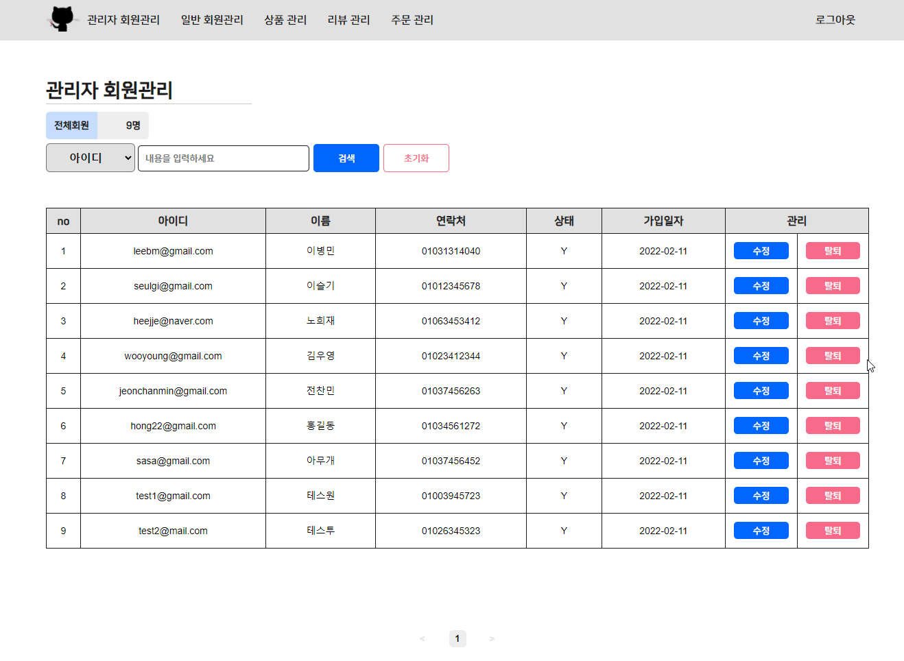

# GreatCatsby-FrontEnd

      

<br>

## 👋 소개
고양이 용품 쇼핑몰 웹사이트 '위대한 캣츠비' 입니다.


<br>

## 📆 작업 기간 
2021-12-14 ~


<br>

## 👥 멤버

|                                   |                                |                                |                               |                                 |
| ------------------------------------------------------------------- | --------------------------------------------------------------- | ---------------------------------------------------------------- | -------------------------------------------------------------- | ----------------------------------------------------------------- |
| <div align="center">[이병민](https://github.com/ByeongminLee)</div> | <div align="center">[김우영](https://github.com/0x000613)</div> | <div align="center">[노희재](https://github.com/heejj1206)</div> | <div align="center">[이슬기](https://github.com/abcabcp)</div> | <div align="center">[전찬민](https://github.com/cksals3753)</div> |

<br>

## 🔍사용자 페이지

### 1. 메인페이지

- 구현 화면
    |<div align="center">기본 화면</div>|
    |-----|
    |로그인 페이지, 각 상품 상세 정보 페이지로 접근이 가능함. 페이지네이션(화면당 상품 20개)이 적용되어 있으며, 페이지 넘김 시 스크롤이 최상단으로 고정됨. <br/><br/>|

    |<div align="center">카테고리별 필터링<br />(전체/사료/모래/장난감/캣타워)</div>|<div align="center">조건별 정렬 <br />(최근 등록순/가격낮은순/가격높은순/리뷰 많은순)</div>|
    |----|-----|
    |||

<br />

-  구성 요소
   |<div align="center">구분</div>|<div align="center">파일명 (*.js)</div>|<div align="center">설 명</div>|
   |---|---|---|
   |서버 연동|MainProductSlice|GET : /products/main|
   |공통 컴포넌트|Loading|로딩 시 출력|
   |공통 컴포넌트|Container|1200px 고정|
   |공통 컴포넌트|Header|사용자 페이지 Header|
   |공통 컴포넌트|Footer|사용자 페이지 Footer|
   |공통 컴포넌트|Pagination|한 페이지당 상품 20개 출력|
   |하위 컴포넌트|Tabs|카테고리 별 필터링 후 출력|
   |하위 컴포넌트|ListBar|조건별 필터링 후 출력|
   |하위 컴포넌트|ProdCard|각 상품 카드 디테일|


<br />

### 2. 상품 정보 페이지
- 구현 화면
    |<div align="center">기본 화면</div>|
    |-----|
    ||

    |<div align="center">상품 수량 선택 기능</div>|
    |-----|
    ||

    |<div align="center">작성된 리뷰가 존재할 경우</div>|
    |-----|
    ||

    |<div align="center">작성된 리뷰가 존재하지 않을 경우</div>|
    |-----|
    ||

<br />

-  구성 요소
   |<div align="center">구분</div>|<div align="center">파일명 (*.js)</div>|<div align="center">설 명</div>|
   |---|---|---|
   |서버 연동|ReviewListSlice|GET : /review/:prod_id|
   |서버 연동|ReviewProdInfoSlice|GET : /products/:prod_id|
   |공통 컴포넌트|Loading|로딩 시 출력|
   |공통 컴포넌트|Container|1200px 고정|
   |공통 컴포넌트|Header|사용자 페이지 Header|
   |공통 컴포넌트|Footer|사용자 페이지 Footer|
   |공통 컴포넌트|Button|버튼 UI|
   |하위 컴포넌트|ProdImg|상품이미지를 가져오는 컴포넌트|
   |하위 컴포넌트|ProdInfo|상품정보를 가져오는 컴포넌트|
   |하위 컴포넌트|ProdReview|상품리뷰를 가져오는 컴포넌트|
   |하위 컴포넌트|ProdBuy|상품 구매(수량 선택등) UI 컴포넌트|
<br />

## 🔍관리자 페이지
### 1. 관리자 회원 관리
- 구현 화면
  |<div align="center">회원 검색</div>|<div align="center">회원 탈퇴</div>|
    |----|-----|
    |||

    |<div align="center">회원 정보 수정</div>|<div align="center">수정된 값 없음</div>|
    |----|-----|
    | ||

<br />

-  구성 요소
   |<div align="center">구분</div>|<div align="center">파일명 (*.js)</div>|<div align="center">설 명</div>|
   |---|---|---|
   |서버 연동|AdminUserSlice|GET : /admins/all, <br />PUT : /admins/edit/:user_id, /admims/getout/user_id|
   |공통 컴포넌트|Loading|로딩 시 출력|
   |공통 컴포넌트|Container|1200px 고정|
   |공통 컴포넌트|Button|버튼|
   |공통 컴포넌트|Alert|알림창|
   |공통 컴포넌트|AdminHeader|관리자 페이지 Header|
   |공통 컴포넌트|Title|관리자 페이지 제목|
   |공통 컴포넌트|Search|관리자 페이지 검색|
   |공통 컴포넌트|TableList|관리자 페이지 테이블|
<br />

### 2. 일반 회원 관리  
- 구현 화면
  |<div align="center">회원 검색</div>|<div align="center">회원 탈퇴</div>|
    |----|-----|
    |||

    |<div align="center">회원 정보 수정</div>|<div align="center">수정된 값 없음</div>|
    |----|-----|
    | ||

<br />

-  구성 요소
   |<div align="center">구분</div>|<div align="center">파일명 (*.js)</div>|<div align="center">설 명</div>|
   |---|---|---|
   |서버 연동|MemberSlice|GET : /members/all, <br />PUT : /members/edit/:user_id, /members/getout/user_id|
   |공통 컴포넌트|Loading|로딩 시 출력|
   |공통 컴포넌트|Container|1200px 고정|
   |공통 컴포넌트|Button|버튼|
   |공통 컴포넌트|Alert|알림창|
   |공통 컴포넌트|AdminHeader|관리자 페이지 Header|
   |공통 컴포넌트|Title|관리자 페이지 제목|
   |공통 컴포넌트|Search|관리자 페이지 검색|
   |공통 컴포넌트|TableList|관리자 페이지 테이블|
   |공통 컴포넌트|Pagination|한 페이지당 10명 출력|

<br />

### 3. 관리자 로그인 페이지
- 구현 화면
   |<div align="center">기본 화면</div>|
   |-----|
   ||

<br />

-  구성 요소
   |<div align="center">구분</div>|<div align="center">파일명 (*.js)</div>|<div align="center">설 명</div>|
   |---|---|---|
   |서버 연동|adminLoginSlice, adminAppSlice|POST : /admins/login|
   |공통 컴포넌트|Loading|로딩 시 출력|
   |공통 컴포넌트|Container|1200px 고정|
   |공통 컴포넌트|Button|버튼|
   |공통 컴포넌트|Input|입력폼|
<br />

## ⚙️ 파일 구조

```
├── README.md
├── src
│   ├── components
│   │     ├── admin
│   │     │    ├── AddProd.js
│   │     │    ├── AdminHeader.js
│   │     │    ├── Search.js
│   │     │    ├── TableList.js
│   │     │    └── TableListWithoutPagination.js
│   │     ├── users
│   │     │    ├── Header.js
│   │     │    ├── Footer.js
│   │     │    ├── ListBar.js
│   │     │    ├── NewAdress.js
│   │     │    ├── PayAdress.js
│   │     │    ├── PayMent.js
│   │     │    ├── ProdBuy.js
│   │     │    ├── ProdCard.js
│   │     │    ├── ProdImg.js
│   │     │    ├── ProdInfo.js
│   │     │    ├── ProdOrder.js
│   │     │    ├── ProdReview.js
│   │     │    ├── ProdReviewInfo.js
│   │     │    ├── RecentAdress.js
│   │     │    ├── ReviewWrite.js
│   │     │    ├── Success.js
│   │     │    └── Tabs.js
│   │     └── common
│   │          ├── Alert.js
│   │          ├── Button.js
│   │          ├── Container.js
│   │          ├── Input.js
│   │          ├── Loading.js
│   │          ├── Logo.js
│   │          ├── Meta.js
│   │          ├── Pagination.js
│   │          ├── ProdBill.js
│   │          ├── ReviewCard.js
│   │          ├── ReviewList.js
│   │          ├── Stars.js
│   │          └── Title.js
│   ├── pages
│   │     ├── admin
│   │     │    ├── AdminLogin.js
│   │     │    ├── ManageAdmin.js
│   │     │    ├── ManageMember.js
│   │     │    ├── ManageOrder.js
│   │     │    ├── ManageProd.js
│   │     │    └── ManageReview.js
│   │     ├── users
│   │     │    ├── Login.js
│   │     │    ├── Main.js
│   │     │    ├── ProdList.js
│   │     │    ├── Register.js
│   │     │    ├── RegSuccess.js
│   │     │    ├── Review.js
│   │     │    ├── Showmethemoney.js
│   │     │    └── Thankyou.js
│   │     └── common
│   │          └── NotFound.js
│   ├── slices
│   │     ├── admin
│   │     │    ├── AddProdSlice.js
│   │     │    ├── adminAppSlice.js
│   │     │    ├── adminLoginSlice.js
│   │     │    ├── AdminReviewListSlice.js
│   │     │    ├── AdminUserSlice.js
│   │     │    ├── ManageOrderSlice.js
│   │     │    ├── ManageProdSlice.js
│   │     │    └── MemberSlice.js
│   │     ├── users
│   │     │    ├── AppSlice.js
│   │     │    ├── JoinSlice.js
│   │     │    ├── LoginSlice.js
│   │     │    ├── MainProductSlice.js
│   │     │    ├── NewMemberSlice.js
│   │     │    ├── RecentMemberSlice.js
│   │     │    ├── ReviewListSlice.js
│   │     │    ├── ReviewProdInfoSlice.js
│   │     │    ├── ReviewWriteSlice.js
│   │     └────└── ShowOrderSlice.js
│   ├── css
│   │     ├── color.module.scss
│   │     └── font.module.scss
│   ├── fonts
│   ├── img
│   ├── App.js
│   ├── index.js
│   ├── key.js
│   ├── store.js
│   └── GlobalStyles.js
├── package-lock.json
├── package.json
└── .prettierrc.js

```
